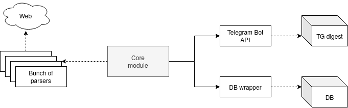

# News buddy !

Твой персональный новостной помошник. 
Может прислать дайджест с новостями на текущий момент из разных новостных порталов. 
Пока поддерживается [Gazeta.ru](gazeta.ru) и [rbc.ru](rbc.ru). 
Кроме новостей можно читать дайджест от [habr.ru](habr.ru) по определнным хабам за текущий день.

План развития пока что выглядит следующим образом:
- Добавить возможность выбора хабов для формирования дайджеста от habr.ru
- Реализовать сбор новостей определенных тем с rbc.ru, например рбк инвестиции [quote.rbc.ru](quote.rbc.ru) или раздел политика из [gazeta.ru](www.gazeta.ru/politics/)
- Реализовать механизм создания дэшбордов для новостного фона каждой недели
- Добавить сохранение результатов всех запросов к боту в `PostgresSQL` для последующего анализа активности пользователей
- Придумать как эффективно хранить результаты парсинга для
- Добавить сбор новостей с [reddit.com](https://www.reddit.com/r/worldnews/?hl=)

## Архитектура сервиса на текущий момент

### Стек технологий

- `python3.8`
- `Docker` + `docker-compose`
- `PostgreSQL` + `psycopg2`
- `Telegram Bot API`
- Логирование - `loguru`

## Set up #wip

Easy way:
1. `git clone https://github.com/mvrck96/news_buddy`
2. `pip install -r requirements.txt`
3. `cd news_buddy`
4. Add your token to `token.txt`
5. Run `python bot.py`

Docker way: (outdated)
1. ~~Make sure that docker is installed~~
2. ~~Repeat steps 1-3 from easy way installation~~
3. ~~`docker build -t newsbuddy .`~~
4. ~~`docker run --name=NB -d newsbuddy`~~
5. ~~Voila ! Bot is running now~~
